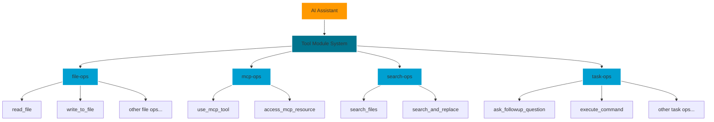
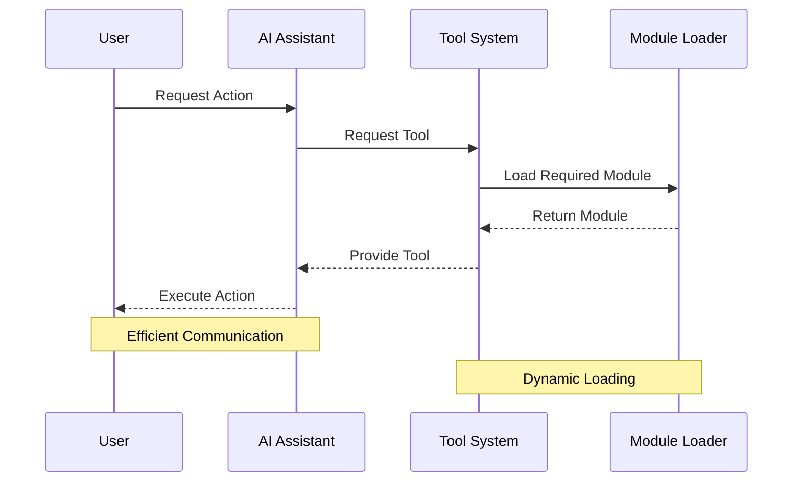

# 🛠️ RooLite

<div align="center">


[](https://github.com/yourusername/your-repo)

*A smart and efficient tool management system for AI assistants*

</div>

---

## 🎯 What is this project

> *"Load only what you need, when you need it."*

This project implements a modular tool system for AI assistants that optimizes token usage by loading only the necessary tools on demand. Instead of sending all available tools in every request, the system organizes tools into modules and loads them as needed.

### 🏗️ Architecture



### 🔄 System Flow



## 💡 Why I started this project

<table>
<tr>
<td>❌ Traditional Approach Issues</td>
<td>✅ Our Solution</td>
</tr>
<tr>
<td>

- High token consumption
- Reduced efficiency
- Complex tool management
- Increased costs

</td>
<td>

- Modular tool loading
- Optimized efficiency
- Organized structure
- Cost-effective

</td>
</tr>
</table>

## ⚡ How this project solves token issues

### 📦 Module Organization
- 🗂️ Tools organized into specific categories
- 📄 Clear documentation structure
- 🔍 Easy tool discovery and access

### 🚀 On-demand Loading
- 🎯 Tools loaded only when needed
- 📑 Separated documentation
- ⚡ Reduced token usage
- 🔋 Efficient resource usage

### 🌐 MCP (Model Context Protocol) Integration

The system supports various MCP servers that extend functionality:

#### 🔍 Brave Search Server
```bash
npx -y @modelcontextprotocol/server-brave-search
```
> Enables powerful web search capabilities

#### 🔄 Atlassian Server
```bash
uvx mcp-atlassian
```
> Seamless integration with Atlassian products

📁 MCP tool documentation location:
`.tools/mcp-ops/[server-name]/*.json`

Example structure:
```
.tools/mcp-ops/
├── brave-search/
│   └── tools.json
└── mcp-atlassian/
    └── tools.json
```

## ⚖️ Pros and Cons

### ✨ Advantages
- 📉 Significantly reduced token usage
- 🏗️ Better organization and maintainability
- 📦 Modular and scalable architecture
- 📚 Clear documentation structure
- 🛠️ Easier to manage and update tools
- ⚡ Improved performance
- 🔌 Extensible through MCP servers

### ⚠️ Limitations
- 🔧 Initial setup complexity
- 📋 Need for proper module organization
- 📚 Learning curve for new developers
- 🔄 Module dependency management
- ⚙️ MCP servers need separate installation

## 🚀 Installation

### 📋 Setup Steps

1. Download the required directories:
   - `.tools/` - Contains all tool modules and documentation
   - `.roo/` - Contains system prompts and configuration

2. Place these directories in your project's root directory:
```
your-project/
├── 📁 .tools/
│   ├── 📁 file-ops/
│   ├── 📁 mcp-ops/
│   ├── 📁 search-ops/
│   └── 📁 task-ops/
├── 📁 .roo/
│   ├── 📄 system-prompt-architect
│   ├── 📄 system-prompt-code
│   └── 📄 other-prompts...
└── 📁 your-project-files...
```

3. *(Optional)* Install MCP servers:
```bash
# 🔍 For Brave Search capabilities
npx -y @modelcontextprotocol/server-brave-search

# 🔄 For Atlassian integration
uvx mcp-atlassian
```

That's it! No additional dependencies required. The system works with your existing AI assistant setup, providing a modular tool structure that optimizes token usage.

### 🎮 Basic Usage

The tools are automatically loaded on-demand when needed. The modular structure ensures that only the necessary tools and their documentation are loaded into the conversation context, significantly reducing token usage.

---

<div align="center">

📚 *For more detailed information about each module and its tools, refer to the documentation in the `.tools` directory.*

</div>

---

<div align="center">

Made with ❤️ for the AI community

</div>