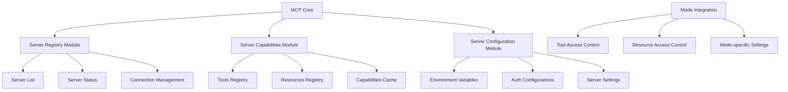

# MCP Server Module Implementation Plan

## Overview
This plan outlines the addition of modules to handle installed MCP servers and their capabilities within the modular system architecture.



## Implementation Components

### 1. Server Registry Module (`system/core/mcp/server-registry.md`)
- Maintains list of installed MCP servers
- Tracks server status (enabled/disabled)
- Handles server registration/deregistration
- Connection state management

### 2. Server Capabilities Module (`system/core/mcp/server-capabilities.md`)
- Tool definitions and schemas
- Resource templates
- Dynamic capability loading
- Capability validation

### 3. Server Configuration Module (`system/core/mcp/server-config.md`)
- Environment variable management
- Authentication configuration
- Server-specific settings
- Configuration validation

### 4. Module Registry Updates
```json
{
  "core.mcp.server-registry": {
    "path": "core/mcp/server-registry.md",
    "required": true,
    "dependencies": ["core.mcp.base"]
  },
  "core.mcp.server-capabilities": {
    "path": "core/mcp/server-capabilities.md",
    "required": true,
    "dependencies": ["core.mcp.server-registry"]
  },
  "core.mcp.server-config": {
    "path": "core/mcp/server-config.md",
    "required": true,
    "dependencies": ["core.mcp.server-registry"]
  }
}
```

## Directory Structure
```
system/
├── core/
│   └── mcp/
│       ├── base.md
│       ├── server-registry.md
│       ├── server-capabilities.md
│       └── server-config.md
└── config/
    └── mcp-servers/
        └── default-config.json
```

## Implementation Steps

1. Create Server Registry Module
   - Define server registration interface
   - Implement status tracking
   - Add connection management

2. Create Server Capabilities Module
   - Design capability schema
   - Implement dynamic loading
   - Add validation logic

3. Create Server Configuration Module
   - Define configuration schema
   - Add environment variable handling
   - Implement auth configuration

4. Update Module Registry
   - Add new module definitions
   - Update dependencies
   - Add metadata

5. Integration Testing
   - Test server registration
   - Validate capability loading
   - Verify configuration management

6. Documentation
   - Update module documentation
   - Add usage examples
   - Document configuration options