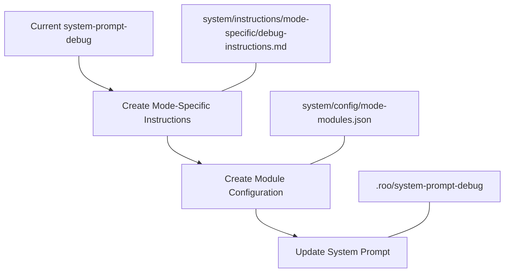

# Plan: Modularize System Prompt Debug Mode

## Overview

This plan outlines the steps to convert the system-prompt-debug into a modular structure following the guide in system/instructions/modular-mode-guide.md.



## Implementation Steps

### 1. Create Mode-Specific Instructions
- Location: system/instructions/mode-specific/debug-instructions.md
- Content:
  - Role definition as expert software debugger
  - Core debugging capabilities 
  - Response guidelines
  - Debug-specific restrictions

### 2. Update Module Configuration
- Location: system/config/mode-modules.json
- Configuration:
  ```json
  {
    "modes": {
      "debug": {
        "required_modules": [
          "core.tool-format",
          "core.base-rules",
          "core.system-info",
          "tools.file-ops.*",
          "tools.search-ops.*"
        ],
        "optional_modules": [
          "tools.mcp.*",
          "core.optional.extended-capabilities"
        ],
        "instructions": [
          "shared.language-prefs",
          "mode-specific.debug-instructions"
        ],
        "restrictions": {
          "file_patterns": [".*"],
          "tool_access": ["read", "edit", "command", "search"]
        }
      }
    }
  }
  ```

### 3. Update System Prompt
- Location: .roo/system-prompt-debug
- Changes:
  - Remove duplicated content
  - Reference core modules
  - Maintain only debug-specific customizations
  - Use absolute paths for file references

## Implementation Order
1. Create debug-instructions.md first to extract core functionality
2. Update mode-modules.json with proper configuration
3. Update system-prompt-debug to use new modular structure