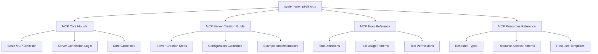

# MCP Modularization Plan

## Overview

This plan outlines the modularization of the MCP (Model Context Protocol) section while maintaining all existing functionality and structure.



## Module Structure

### 1. MCP Core Module (`system/core/mcp/base.md`)
- Basic MCP definition and purpose
- Server connection handling
- Core operational guidelines
- Cross-cutting concerns

### 2. MCP Server Creation Guide (`system/core/mcp/server-creation.md`)
- Detailed server creation steps
- Configuration file management
- Environment setup guidelines
- Example server implementation

### 3. MCP Tools Reference (`system/tools/mcp/tools-reference.md`)
- Tool definitions and schemas
- Usage patterns and best practices
- Permission management
- Error handling

### 4. MCP Resources Reference (`system/tools/mcp/resources-reference.md`)
- Resource types and definitions
- Access patterns
- Resource templates
- URI formats

## Implementation Steps

1. Create directory structure:
   ```
   system/
   ├── core/
   │   └── mcp/
   │       ├── base.md
   │       └── server-creation.md
   └── tools/
       └── mcp/
           ├── tools-reference.md
           └── resources-reference.md
   ```

2. Extract and categorize content from system-prompt-devops
3. Update cross-references between modules
4. Test MCP functionality after modularization
5. Add module registry entries

## Key Considerations

- Maintain all existing functionality
- Preserve current structure and capabilities
- Ensure seamless integration
- Allow for easy updates and extensions
- Keep consistent documentation style