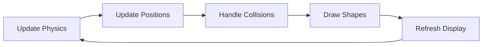

# Rotating Shapes with Bouncing Ball Implementation Plan

## Overview
Create a Python program using Pygame to simulate a rotating pentagon within a rotating square, with a ball bouncing between them under the influence of gravity and friction.

## Technical Architecture

## Components Design

### 1. Core Classes Structure

### 2. Technical Requirements
- **Display Window**: 800x600 pixels
- **Graphics Library**: Pygame
- **Physics Constants**:
  - Gravity: 9.81 m/s²
  - Friction coefficient: 0.8
  - Energy loss on collision: 20%

### 3. Animation Parameters
- Square rotation: 90 degrees/second (1 revolution/4 seconds)
- Pentagon rotation: 60 degrees/second (1 revolution/6 seconds)
- Ball initial velocity: Random direction with speed 5 pixels/frame
- Frame rate: 60 FPS

## Implementation Steps

1. **Setup Phase**
   - Initialize Pygame
   - Create display window
   - Set up game clock
   - Define color constants

2. **Shape Classes Implementation**
   - Create base Shape class
   - Implement Square class
   - Implement Pentagon class
   - Implement Ball class

3. **Physics Implementation**
   - Gravity calculations
   - Friction application
   - Collision detection algorithms
   - Velocity and position updates

4. **Animation Loop**

5. **Collision Detection**
   - Ball-Square edge collision
   - Ball-Pentagon edge collision
   - Edge normal calculation
   - Bounce vector computation

## Testing Strategy

1. **Unit Tests**
   - Shape rotation calculations
   - Physics calculations
   - Collision detection accuracy

2. **Visual Tests**
   - Smooth rotation of shapes
   - Natural ball movement
   - Realistic collision responses

## Dependencies
- Python 3.8+
- Pygame 2.0+
- NumPy (for vector calculations)