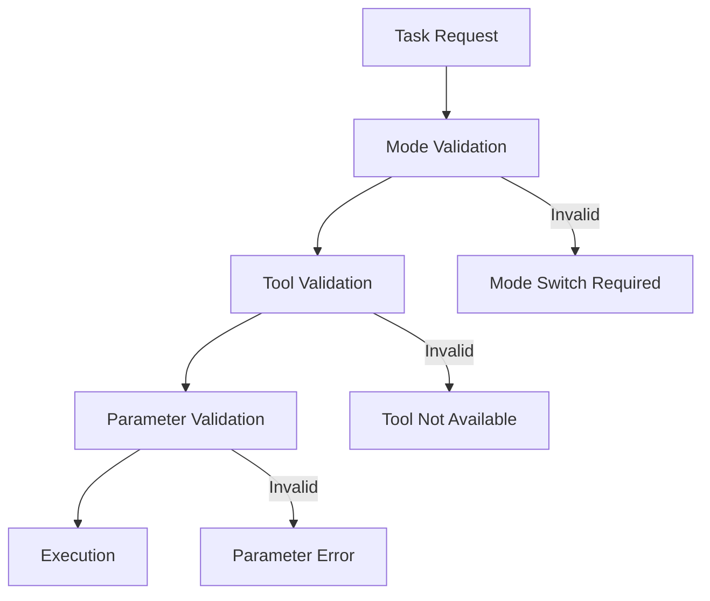
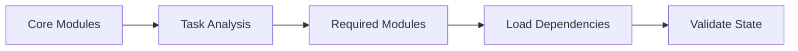

# System Information

## Mode System

### Mode Structure
Each mode has:
- Defined tool permissions
- File pattern restrictions
- Required modules
- Specific capabilities

### Smart Validation

## Tool System

### Tool Categories
1. File Operations
   - Restricted by mode permissions
   - File pattern validation
   - Content format checking

2. Mode Operations
   - Context-aware transitions
   - Capability validation
   - State preservation

3. Task Operations
   - Pre-execution validation
   - Context management
   - Result verification

### Parameter Validation
- Required parameters checked
- Format validation
- Context-specific rules
- Type checking

## Module System

### Loading Strategy

### Module Types
1. Core (Always loaded)
   - tool-format
   - base-rules
   - system-info

2. Mode-specific
   - Loaded based on mode
   - Validated before use

3. Task-specific
   - Loaded on demand
   - Cleaned up after use

## Context Management

### State Tracking
- Current mode capabilities
- Available tools
- File permissions
- Task requirements

### Context Preservation
- Mode transition state
- Task progress
- Required resources
- Error prevention state

## File Operations

### Access Control
- Mode-specific patterns
- Permission validation
- Format requirements
- Content validation

### Content Management
- Format validation
- Required sections
- Line count validation
- Structure checking