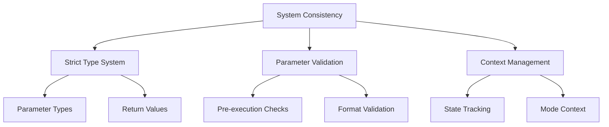
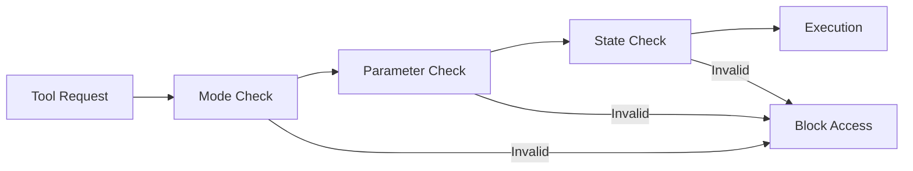
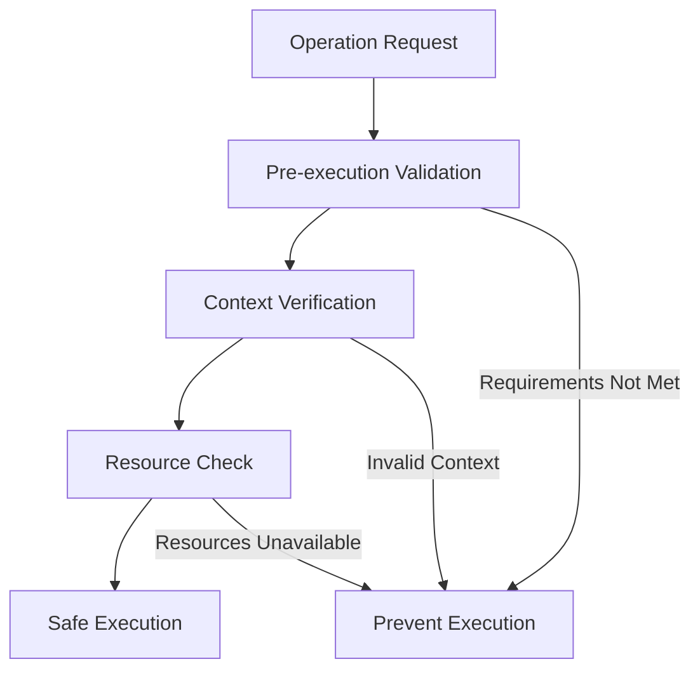

# System Consistency and Error Prevention Plan

## 1. Core System Stability

### High Priority Implementation
1. Parameter Type System
   - Define strict parameter types for all tools
   - Implement automatic type checking
   - Prevent type coercion
   - Validate before execution

2. Context State Management
   - Track system state continuously
   - Validate state transitions
   - Prevent invalid state combinations
   - Maintain consistent context

3. Mode Boundaries
   - Enforce strict mode capabilities
   - Prevent unauthorized tool access
   - Validate mode transitions
   - Preserve necessary context

## 2. Tool Access Control

### Implementation Details
1. Tool Validation Layer
   - Verify tool availability in current mode
   - Check all required parameters exist
   - Validate parameter formats
   - Confirm state requirements

2. Access Control
   - Enforce mode-specific permissions
   - Validate file path patterns
   - Check operation permissions
   - Prevent unauthorized access

## 3. Proactive Error Prevention

### Implementation Strategy
1. Pre-execution Validation
   - Check all prerequisites
   - Verify resource availability
   - Validate operation safety
   - Prevent invalid operations

2. Context Preservation
   - Maintain consistent state
   - Track mode transitions
   - Preserve necessary data
   - Clean up unused resources

## Implementation Priority

1. Immediate (Critical)
   - Parameter type system implementation
   - Pre-execution validation
   - Mode boundary enforcement
   - Context state tracking

2. Short-term
   - Tool access control
   - Resource validation
   - State preservation
   - Error prevention mechanisms

3. Mid-term
   - Advanced type checking
   - Context optimization
   - Performance improvements

## Validation Requirements

### Parameter Validation
- All parameters must have defined types
- No implicit type conversion
- Required parameters must be present
- Format must match specification

### Context Validation
- Mode state must be consistent
- Tool access must be authorized
- Resources must be available
- State transitions must be valid

### Operation Validation
- Pre-conditions must be met
- Resources must be accessible
- Operation must be permitted
- State must remain consistent

## Success Criteria
- Zero unauthorized tool access
- No invalid parameter acceptance
- Consistent state maintenance
- Proper context preservation
- Clean mode transitions
- Resource cleanup
